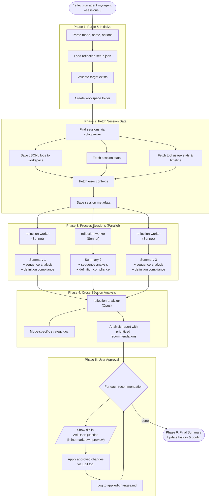

# Claude Reflection Plugin

A globally installable [Claude Code](https://claude.ai/code) plugin that analyzes session logs and proposes improvements to your CLAUDE.md, memory files, agent definitions, and skill definitions.

## What It Does

The Reflection Plugin reads your Claude Code session logs (via the `cclogviewer` MCP server), identifies patterns — mistakes, user corrections, workflow inefficiencies — and generates specific, evidence-based recommendations to improve your setup.

### Three Reflection Modes

| Mode | Command | Analyzes | Suggests improvements to |
|------|---------|----------|--------------------------|
| **Direct** | `/reflect:run direct` | Direct Claude usage sessions | CLAUDE.md, memory files |
| **Agent** | `/reflect:run agent <name>` | Agent sessions | Agent `.md` definition |
| **Skill** | `/reflect:run skill <name>` | Skill sessions | SKILL.md, @docs/, @templates/ |

## Installation

### Option 1: Inside Claude Code (interactive)

```
/plugin marketplace add SeleznovIvan/claude-reflection-plugin
/plugin install reflect@claude-reflection-plugin
```

Restart Claude Code to load the plugin.

### Option 2: From terminal

```bash
claude plugin marketplace add SeleznovIvan/claude-reflection-plugin
claude plugin install reflect@claude-reflection-plugin --scope user
```

### Post-install setup

Run the setup skill to install the `cclogviewer` MCP dependency and configure your project:

```
/reflect:setup
```

This will:
1. Install `cclogviewer-mcp` binary
2. Register it as an MCP server with Claude Code
3. Auto-discover your project name from session logs
4. Create `.claude/reflection-setup.json` in your project

## Usage

```bash
# Analyze direct Claude usage (last 7 days, up to 5 sessions)
/reflect:run direct

# Analyze an agent with custom range
/reflect:run agent playwright-e2e-specialist --sessions 5 --days 14

# Analyze a skill
/reflect:run skill managing-storage --sessions 3
```

### Options

| Option | Default | Description |
|--------|---------|-------------|
| `--sessions N` | 5 | Maximum sessions to analyze |
| `--days N` | 7 | Look back N days |

## How It Works

The reflection loop runs in 6 phases:

1. **Parse & Initialize** — Validate arguments, load project config, create workspace
2. **Fetch Session Data** — Retrieve session logs, stats, timeline, and tool usage from `cclogviewer` MCP
3. **Process Sessions** — Parallel `reflection-worker` agents (Sonnet) produce per-session summaries with tool sequence analysis and definition compliance checks
4. **Analyze Summaries** — `reflection-analyzer` agent (Opus) performs cross-session analysis with mode-specific strategy
5. **User Approval** — Present each recommendation for approval/rejection, apply approved changes
6. **Final Summary** — Report results, update reflection history



### Suggestion Routing

Recommendations are automatically routed to the correct file:

- **Direct mode**: Prescriptive rules → `CLAUDE.md` | Descriptive learnings → memory files
- **Agent mode**: All suggestions → agent `.md` definition
- **Skill mode**: Suggestions → `SKILL.md`, `@docs/`, or `@templates/` files

## Plugin Structure

```
├── .claude-plugin/plugin.json      # Plugin manifest
├── .mcp.json                       # MCP dependency (cclogviewer)
├── CLAUDE.md                       # Plugin instructions
├── skills/
│   ├── run/
│   │   ├── SKILL.md                # Main orchestrator (/reflect:run)
│   │   └── docs/
│   │       ├── PROCESSING.md       # Worker instructions
│   │       ├── ANALYSIS-DIRECT.md  # Direct mode strategy
│   │       ├── ANALYSIS-AGENT.md   # Agent mode strategy
│   │       └── ANALYSIS-SKILL.md   # Skill mode strategy
│   └── setup/
│       └── SKILL.md                # /reflect:setup
└── agents/
    ├── reflection-worker.md        # Per-session processor (Sonnet)
    └── reflection-analyzer.md      # Cross-session analyzer (Opus)
```

## Requirements

- [Claude Code](https://claude.ai/code) CLI
- `cclogviewer-mcp` binary (installed via `/reflect:setup`)

## License

MIT
